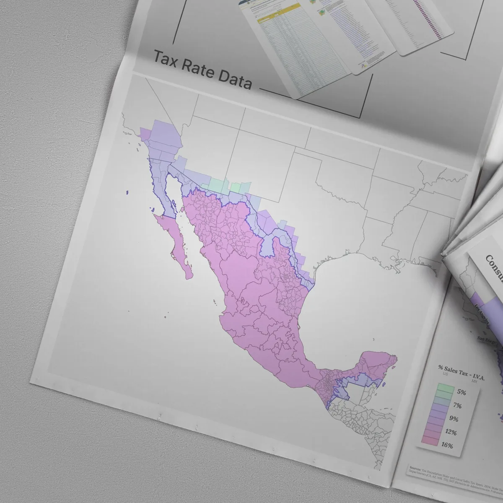

# KiyViz copy style guide

The voice and format every BLUF (Bottom Line Up Front) case-study module
must follow. Source of truth for the copywork pass.

> **Audience:** college-educated, time-scarce. They are smart and they
> are busy. The job is to respect both.

---

## Four core rules

### 1. Footnotes & references are our friend

If a term has a clean Wikipedia-able answer (`IVA`, `orthographic projection`,
`ligature`, `Pantone Coated`, `kerning`), the term goes in the body and the
gloss goes in a numbered footnote at the bottom. Example:

> Built in QGIS from INEGI[^1] administrative boundaries and Tax Foundation
> rate data.
>
> [^1]: INEGI — *Instituto Nacional de Estadística y Geografía*, Mexico's
>       national statistics office. Their *Marco Geoestadístico* dataset is
>       the canonical municipal-boundary file for the country.

This keeps the body fast and the curious reader fully served. **No glosses
in parentheses inline** — they break reading speed.

### 2. Skimmable

Every page should be readable in **two passes**:

- **Pass 1 — 15 seconds.** Bottom Line, TL;DR bullets, hero image, headings.
  By the end of pass 1, the reader knows what the project was, who it was
  for, and whether they care about pass 2.
- **Pass 2 — 3–5 minutes.** Context, Process, Craft notes, Gallery, Sources.
  Bulleted lists for craft details. Short paragraphs. Numbered steps when
  process is sequential. **No wall of prose.**

If a paragraph is more than 4 sentences, break it. If a sentence is more
than 25 words, split it. If a list could be a list, make it a list.

### 3. Never patronize, never alienate

> Avoid jargon, but if necessary, use it and explain it (in a footnote).
> Don't treat readers as unintelligent — assume they're literate.

- Don't write "industry-standard mapping software" — say **QGIS**.
- Don't write "we used proprietary techniques" — that's puffery.
- Don't write "as you may know…" — patronizing.
- Don't write "obviously" — patronizing.
- Don't water down a technical decision for the audience. Make it, name
  it, footnote the term if needed, and move on.
- The reader is intelligent. The reader is busy. The reader will skim.
  Reward both.

### 4. Respect their time and intelligence

Length budget per page:

| Section | Target words |
|---|---|
| Bottom Line | ≤ 25 |
| TL;DR (5 bullets) | ≤ 75 total (≤ 15 each) |
| Context | 100–180 |
| Process | 150–250 |
| Craft notes (4–8 bullets) | 80–160 |
| Gallery captions (each) | 15–30 |
| Sources & credits | 50–120 |
| Footnotes | 80–200 |
| **Total body** | **450–700 words** |

If a draft exceeds 700 words, cut. If under 450, the project is being
under-sold or the brief is missing.

---

## Page anatomy

Every case-study page is exactly this structure. The HTML template at
`26Q2.1/work/_template.html` already has slots for each. Updated
2026-04-10 per the user's "remove busy meta strip / replace TL;DR with
project specs / add inline figures" pass.

```
┌──────────────────────────────────────────────────────────┐
│  breadcrumbs                                             │  ← static
│  H1: Project title (bilingual, · separator)              │
│  subtitle (one sentence)                                 │
│  BLUF pullquote (the bottom line)                        │
│  ┌────────────────────────────────────────────────┐      │
│  │ scope · alcance       │ value (en + es)        │      │  ← project specs
│  │ service · servicio    │ value                  │      │     (replaces old
│  │ deliverables · entr.  │ value                  │      │      meta + TL;DR)
│  │ timeline · fechas     │ value                  │      │
│  └────────────────────────────────────────────────┘      │
│  [tag pills]                                             │
│  HERO IMAGE (real or diagonal-stripe placeholder)        │
│  ─────────                                               │
│  body — rich text from _copywork/<slug>.md               │
│    ## Context / ## Process / ## Craft notes / etc.      │
│    paragraphs, lists, blockquotes, links, **bold**       │
│                         │
│    [^1] footnote refs + auto-rendered footnote section   │
│  ─────────                                               │
│  prev / index / next nav                                 │
└──────────────────────────────────────────────────────────┘
```

### 1 · Title + subtitle

- **Title** is the project's display name. Bilingual (EN + ES). The CSS
  separator `·` shows in "all" mode.
- **Subtitle** is one sentence describing what the project IS, not what it
  did. Bilingual.

### 2 · Bottom Line (BLUF pullquote)

> One sentence. ≤ 25 words. The thesis. The thing you'd say if you had
> 5 seconds in an elevator.

**Format:** `[Active verb] [object] [outcome / why-it-mattered].`

**Examples (for reference, not all real):**

- ✅ "KiyViz built a single-graphic op-ed map that made the U.S.–Mexico
  border tax debate legible in five seconds."
- ✅ "A trinational identity system, applied across 80+ hours of report
  layout, custom orthographic cartography, and member collateral."
- ❌ "KiyViz was tasked with creating a graphic to visualize tax rates."
  (passive, no thesis, no outcome)
- ❌ "We worked on a really interesting cartography project for CalChamber."
  (vague, hedged, no specifics)

### 3 · Project specs (the new fact sheet)

A four-row spec sheet that replaces the old top-of-page metadata strip
**and** the TL;DR narrative block. This is the single source of truth
for project metadata: structured facts, no prose.

| Row | English label | Spanish label | What goes here |
|---|---|---|---|
| 1 | scope        | alcance     | The size/depth of the project. "One news cycle, USA-wide" / "80+ hour engagement" / "Single op-ed graphic". |
| 2 | service      | servicio    | What KiyViz did. "Cartography, editorial design" / "Identity creation, typography, color system". |
| 3 | deliverables | entregables | What shipped. Format, count, language, distribution channel. |
| 4 | timeline     | fechas      | When. "March 2025" / "2025 – ongoing" / "March – April 2026". |

Each value is bilingual: written in English with the Spanish version
italic-muted directly below in "all" view, or replaced one-for-one when
the language filter is set to a single language.

The spec values live in the project catalog at the top of
`26Q2.1/work/_stamp.py` under each project's `specs` dict — not in the
markdown body.

### 4 · Tag pills

Categorization labels: `identity`, `editorial`, `cartography`, `policy`,
`exhibition`, `bilingual`, `print`, etc. Comes from the project's `tags`
list in `_stamp.py`. Filterable on the listing page.

### 5 · Hero image

Real image when available. Diagonal-stripe placeholder block when not.
The hero is the visual punchline of the Bottom Line.

### 6 · Body — rich text from `_copywork/<slug>.md`

Everything below the hero is rendered from per-project markdown in
`_copywork/<slug>.md` under two named sections:

```markdown
## body en

Your English body markdown goes here.

## body es

Tu cuerpo en español va aquí.
```

Inner `##` and `###` headings inside a body section are content (NOT new
section delimiters). Only the next `## body en|es` heading or end-of-file
terminates a section.

The stamper at `26Q2.1/work/_stamp.py` runs the body markdown through a
small built-in converter (`md2html`) that supports:

| Markdown | HTML | Notes |
|---|---|---|
| `## Heading` | `<h2>` | Mono with amber `## ` sigil prefix from CSS |
| `### Heading` | `<h3>` | Smaller subheading |
| paragraph | `<p>` | Blank-line separated |
| `**bold**` | `<strong>` | Ink color |
| `*italic*` / `_italic_` | `<em>` | |
| `` `code` `` | `<code>` | Mono inline pill |
| ` ```code block``` ` | `<pre><code>` | Mono block, ink color |
| `[text](url)` | `<a>` | Amber underline |
| `- item` / `* item` | `<ul><li>` | Square bullet, moss marker |
| `1. item` | `<ol><li>` | Amber numbered marker |
| `> quote` | `<blockquote>` | Moss left border, italic |
| `---` | `<hr>` | Dashed divider |
| `` | `` | Plain image |
| `` | `<figure class="case-fig">` | **Inline figure with `<figcaption>`** |
| `[^1]` body ref | `<sup class="fn-ref">` | Superscript amber link |
| `[^1]: gloss` | auto-rendered footnote section at bottom | All footnotes collected, numbered, with back-link arrows |

### 7 · Inline figures — the rich-text image feature

Author them inline anywhere in the body markdown, on their own line:

```markdown
Here's a paragraph of body text.



Next paragraph picks up after the figure.
```

The third (quoted) argument is the **caption** that renders below the
image. Without it you get a plain `` inline.

**Bleed variants** — to make a figure break out of the body's reading
measure, drop `[bleed]` or `[wide]` into the alt text:

```markdown
![[wide] A two-column comparison of palette tiers](../assets/img/work/foo.webp "Caption")
```

| Marker | Effect |
|---|---|
| (none) | Figure constrained to the 66ch body measure |
| `[wide]` | Figure expands to 100% of the case-study container |
| `[bleed]` | Figure ignores all width caps (rare, use sparingly) |

### 8 · Footnotes — auto-rendered

Drop `[^1]` (or any short identifier) inline anywhere in the body.
Define each footnote at the bottom of the body section as `[^1]: gloss
text`. The stamper collects all definitions and emits a `Footnotes`
section automatically — you don't need to manually create it.

Conventions:

- One footnote per piece of jargon, foreign term, or insider reference
- Body-of-footnote should be one or two sentences max
- Linked back from the body via `<sup class="fn-ref">[1]</sup>` style superscript
- Each rendered footnote has a back-link arrow (`↩`) returning to its source

### 9 · Body sections — recommended structure

Within `## body en` / `## body es`, use these inner headings in order:

```markdown
## body en

## Context

What was true before KiyViz showed up. The client, the brief, the world.
2 short paragraphs.

## Process

What KiyViz did. Numbered list when sequential, paragraphs when not.
Name the tools and sources.


## Craft notes

- **label** — Specific detail.
- **another** — Specific detail.

## Sources & credits

- Anyone who contributed
- Any data sources, fonts, image rights

[^1]: Footnote definition.
[^2]: Another footnote definition.
```

The footnotes section is auto-generated; don't write a `## Footnotes`
heading yourself.

---

## Voice rules (cheat sheet)

| Do | Don't |
|---|---|
| First word matters — lead with the verb or the outcome | Lead with "KiyViz was tasked with…" |
| Active voice | Passive voice |
| Specific tools by name (QGIS, INEGI, Bebas Neue Pro) | "Industry-standard software" |
| Pick one persona — "the studio" OR "KiyViz" — and stay there | Flip between "we", "I", "KiyViz", "the team" |
| Bilingual EN + ES from the draft | English-first then translated |
| Numbers when they anchor a claim ("80+ hours", "200+ publications") | Numbers as decoration ("many hours") |
| Footnote the jargon | Define it inline in parentheses |
| Short sentences. Short paragraphs. Lists. | Walls of prose |
| Name the constraint and how you beat it | Hide the constraint |

---

## Persona pick

**Use "KiyViz" as the third-person actor.** Not "we", not "I", not "the
studio". This matches how the rest of the site already refers to itself
and avoids the EN/ES persona-flip problem (Spanish "nosotros" vs "el
estudio" gets ugly).

Where the sentence reads weird in third person ("KiyViz designed a
ligature for KiyViz's typeface" — no), use a passive-like construction:
"The ligature was drawn in Illustrator, then refined in Procreate."

---

## Bilingual rules

- Every body block (BLUF, TL;DR, paragraphs, captions) ships with parallel
  EN and ES from the draft. Never translate after the fact.
- Spanish should read like Spanish, not like translated English. Use
  active Spanish constructions (`Diseñé un sistema…`, not
  `Un sistema fue diseñado…`).
- The CSS handles `lang-view: all|en|es`. The copywriter doesn't add
  separators — the CSS does.
- For technical terms that are the same in both languages (`QGIS`,
  `INEGI`, `PDF`, `Pantone`), use the term as-is without italics.
- For terms that differ (`white paper` → `documento técnico`,
  `op-ed` → `artículo de opinión`), pick the natural Spanish form, not
  a calque.

---

## Attribution rules per project

These came from the user brief on 2026-04-10. Bake into every BLUF draft.

| Slug | Attribution rule |
|---|---|
| `nokings`     | "Private client". Do not name. The campaign context (200+ publications including the New York Times, full-page placements supporting a 4th Amendment argument) is fair game. |
| `sis`         | "Self-initiated" / "Derek's IP". This is internal R&D, not client work. |
| `museum-dte`  | "A museum exhibit design-build firm". Do not name the client while the engagement is ongoing — bad form. The user notes they may name the client publicly *after* the engagement closes. |
| `calchamber`  | Real client name OK — published in CalChamber Alert Vol 51 No 9. |
| `nacwg`       | Real client name OK — North American Competitiveness Working Group. |
| `studiosun`   | Brand name "Studio Sun" OK — original commission was a private client but the brand is public-facing. |
| `symphonic`   | Real client name OK — Symphonic Stories. |
| `ioa`         | Real client name OK — Institute of the Americas. |
| `deputy`      | Real client name OK — Institute of the Americas. |
| `heritage`    | Real client name OK — Museo Ruta de Plata Press. |

---

## Workflow per BLUF module

For every project, the workflow is:

1. **Read** the legacy archive page (if any) at
   `_archive/kiyviz-com-legacy/projects/<legacy-slug>/README.md`.
2. **Review** the legacy copy in the module file (`_copywork/<slug>.md`).
   Critique what's weak. Punch list of fixes.
3. **Draft** the new BLUF copy in the same module file. Bilingual from
   the start. Footnotes for jargon. Word counts inside the targets.
4. **Approve** with the user. Iterate.
5. **Stamp** the approved copy into the case-study HTML page by editing
   `26Q2.1/work/_stamp.py`'s body dict for that slug and re-running.
6. **Verify** in preview at `/work/<slug>.html`.

The current pass landed steps 0–1 (template + click-through). Steps 2–5
happen one project at a time, in the order from `_MODULE-PLAN.md`.
