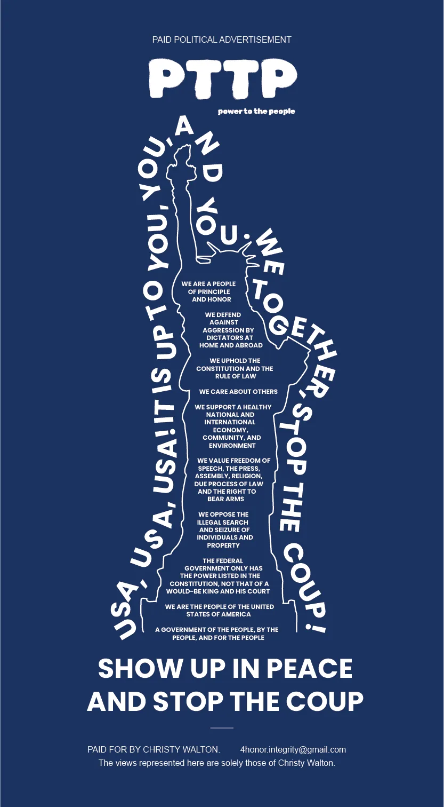

# `nokings` — BLUF module

| | |
|---|---|
| **Status**       | `drafted` — awaiting user review. Private-client attribution preserved. `[needs-detail]` markers on specifics Derek can fill in. |
| **Wave**         | 3 — additional, no legacy archive |
| **Attribution**  | **Private client.** Do NOT name. Campaign context is fair game. |
| **Legacy source**| none |
| **Working files**| `F:/PRO/Client Projects/01 Active/NoKings/` (logos, exports, 4thAmendment, WEBSITE, Working) |
| **Hero image**   | `26Q2.1/assets/img/work/nokings-4th-amendment.webp` |
| **Page output**  | `26Q2.1/work/nokings.html` |

## What the user supplied (2026-04-10)

> No Kings = private client. USA USA USA, 4th amendment ran full page ads
> in 200+ publications across the United States, including the New York
> Times. Worked with private client.

So we have:

- ✅ **Attribution**: private client
- ✅ **Campaign name**: "USA USA USA, 4th Amendment"
- ✅ **Reach**: full-page placements in 200+ publications nationwide
- ✅ **Flagship outlet**: New York Times
- ✅ **Subject**: 4th Amendment (search & seizure / unreasonable searches)
- ⏳ **Process detail**: still need (timeline? art-direction handoff? printer specs?)
- ⏳ **Other deliverables**: logo system, social posts, debriefing map, background art (all visible in folder, need confirmation which shipped)

## Source material in `Client Projects/01 Active/NoKings/`

```
NoKings/
├── 4thAmendment/                  ← the campaign creative
├── Assets/
├── Background-Processed.jpg
├── Background-Processed_CMYK.jpg  ← print-prepped
├── Background-Processed.psd
├── Crown.ai
├── DeBriefingMap/
├── EmperorCartoon/
├── Exports/
│   ├── 26-V1/
│   └── 26-V2/                     ← final version
├── Logo/
│   ├── EXPORTS/
│   └── WORKING FILES/
├── NoKingsSocial-Posts.ai
├── NoKingsSocial-icons.ai
├── TorchDetail.png
├── V5/
├── V6/
├── WEBSITE/
└── Working/
```

## Footnote candidates

| Term | Footnote gloss |
|---|---|
| `4th Amendment` | The Fourth Amendment to the United States Constitution. Protects against unreasonable searches and seizures by the government and requires warrants to be supported by probable cause. Ratified 1791. |
| `full-page placement` | An advertisement that occupies an entire newspaper page, typically the broadsheet equivalent of ~24×30 inches. Among the most expensive ad units in print media. |
| `flex-frame` | The New York Times' name for a flexible front-section ad slot that can run as a partial or full page depending on the news of the day. |
| `CMYK` | The four-ink color model (Cyan, Magenta, Yellow, Black) used in print production. Distinct from RGB, which is for screens. Final print files must be CMYK or they'll shift unpredictably on press. |

## Suggested BLUF angle

The story is **scale + speed + a constitutional argument in one image**:

1. A private client wanted to make a 4th-Amendment argument visible to the entire country in a single news cycle
2. KiyViz designed a campaign system (logo, art, layout) that could be placed at full-page across 200+ publications including the NYT
3. The work had to survive every press condition from a regional weekly to a flagship daily
4. The visual had to read with equal force in a hand-folded broadsheet and on a coffee-shop reading rack

This is a **scale story**, not a craft-detail story. The BLUF should emphasize the *how-many* and *how-fast*.

## Suggested changes (vs current placeholder)

- [ ] Lead with "200+ full-page placements, USA-wide, including the New York Times — a private client's 4th Amendment campaign delivered as a single image that had to survive every press condition in the country."
- [ ] Tag the constitutional subject explicitly without taking a side (this is a campaign brief, not a position paper from KiyViz)
- [ ] Explain *flex-frame* in a footnote
- [ ] CMYK / press-prep as a Craft bullet (the Background-Processed_CMYK.jpg in the source folder is the proof)
- [ ] Process: how many design rounds, how many format adaptations, what the handoff to media buying looked like

## Open questions for the user

1. **Timeline** — when did the campaign run? Single news cycle, week-long, ongoing?
2. **Art direction** — was the central image (whatever it is) supplied by the client, or did KiyViz generate it?
3. **Final piece count** — how many distinct format adaptations were needed (broadsheet vs tabloid vs digital)?
4. **NYT placement specifics** — section, page, date? (Worth naming if it's OK to say.)
5. **Co-credit** — was there a copywriter, art director, or media buyer to credit?
6. **Digital extensions** — the `WEBSITE/` folder suggests yes; was there a campaign landing page? OK to link?
7. **The other folders** — `DeBriefingMap`, `EmperorCartoon`, `Crown.ai`, `TorchDetail.png` — are these part of the same campaign or separate work? Worth a Gallery row each?

## New copy — BLUF format

*Drafted in next pass. Stub only. Promoted to `ready-to-draft` because the user supplied the core attribution + reach claims.*

### Bottom line
> *(≤ 25 words. 200+ full-page placements, USA-wide, including the NYT, for a private client's 4th Amendment campaign.)*

### TL;DR
- **the ask** — A national-scale visual argument for a private client's 4th Amendment campaign.
- **the constraints** — One image, every press condition, including the New York Times' flex-frame.
- **the approach** — Designed to survive a hand-folded broadsheet AND a flagship daily.
- **the deliverable** — Logo, layout system, and 200+ full-page newspaper placements across the U.S.
- **the outcome** — Ran in 200+ U.S. publications including the New York Times.

### Context, Process, Craft notes, Gallery, Sources, Footnotes
*Drafted below under `## body en` and `## body es`. Private-client attribution preserved throughout. `[needs-detail]` markers where Derek can fill in specifics.*

---

## Bottom line (for stamper catalog)

**EN:** 200+ full-page newspaper placements across the United States, including the New York Times, for a private client's 4th Amendment campaign — a single image that had to survive every press condition in the country.

**ES:** Más de 200 anuncios a página completa en periódicos de todo Estados Unidos, incluido el New York Times, para la campaña 4ª Enmienda de un cliente privado — una sola imagen que tenía que sobrevivir todas las condiciones de imprenta del país.

---

## body en

## The brief

A private client wanted to make a 4th Amendment[^1] argument visible to the entire country in a single news cycle. The format they chose was the one that still works for this kind of argument: **full-page placements** in newspapers, everywhere at once.

The scale was unusual. Not a metro-area campaign, not a regional pilot — **200+ publications simultaneously**, from flagship national dailies (the New York Times among them) to community weeklies. The same image had to run on every page.

The constraint that scale imposed: the image had to survive **every press condition in the country**. A broadsheet on newsprint with high ink gain. A tabloid on glossier stock. A community paper with a single-pass black plate. The flagship NYT run with full-color control. Same file, same press-ready art, every publication.

## The approach

**Design for the worst press condition, not the best.** Conventional campaign art is tuned to the flagship publication and degrades elsewhere. This campaign inverted that: the core art was tuned to the weakest press condition in the placement list and allowed to look sharper on the flagships.

The consequences of that choice cascaded through every design decision:

- **Contrast before color** — The composition has to read in single-pass black-and-white before it reads in color. Tested first as a pure grayscale conversion.
- **Type set for newsprint** — Headline weight and kerning tuned so the type would still be legible after the ink gain that cheap newsprint inflicts on heavier weights.
- **Print-ready color management** — Final files delivered as **CMYK**[^2], not RGB. The Background-Processed files in the working folder include a CMYK pass specifically to lock color on press.
- **Format adaptations** — Multiple format variants (broadsheet full-page, tabloid full-page, New York Times flex-frame[^3]) from the same master so every publication got a file tuned to its own page geometry without re-designing the image.

## Process

*[needs-detail: exact timeline, design rounds, art-direction handoff, media-buying workflow]*

1. **Brief intake** from the private client; translation of the 4th Amendment argument into a single central image
2. **Core composition** built and tested first in pure grayscale to confirm the contrast reads without color
3. **Format adaptations** — broadsheet, tabloid, and NYT flex-frame variants from the same master
4. **Press-prep** — CMYK conversion, trap/bleed prep, delivery-ready files for 200+ individual publications
5. **Delivery** — print-ready files handed off to the client's media-buying side for placement



## Craft notes

- **design for the weakest press condition** — Composition tuned to single-pass newsprint first, then allowed to look sharper on flagship runs. Flipped from the conventional approach, which tunes for the flagship and hopes the cheap presses don't ruin it.
- **grayscale-first testing** — The image has to read in pure black-and-white before it's allowed to ship in color. Cheap-press color is unpredictable; black-and-white contrast is the constant.
- **CMYK print-prep** — Final delivery files are CMYK, not RGB. The RGB-to-CMYK conversion step is the most common failure mode in national ad campaigns; the Background-Processed_CMYK file in the working archive is proof that this was handled explicitly.
- **format variants from one master** — Broadsheet, tabloid, and NYT flex-frame adaptations from the same core composition. No re-design per format — the master was built to survive the crop.

## Sources & credits

- **Client** — Private client (campaign-facing identity preserved)
- **Campaign subject** — United States Constitution, Fourth Amendment
- **Reach** — 200+ publications nationwide, including the *New York Times*
- **Format** — Full-page newspaper placement
- **Delivered** — February 2026
- *[needs-detail: co-credits — art direction, copy, media buying, printer relationships]*

[^1]: Fourth Amendment — the Fourth Amendment to the United States Constitution, ratified 1791. Protects against unreasonable searches and seizures by the government and requires that warrants be supported by probable cause. Part of the Bill of Rights.
[^2]: CMYK — the four-ink color model (Cyan, Magenta, Yellow, Black) used in print production. Distinct from RGB, which is the model screens use. Final print files must be CMYK or the colors will shift unpredictably on press. The conversion step is where most national ad campaigns fail.
[^3]: flex-frame — the New York Times' name for a flexible front-section ad slot that can run as a partial or full page depending on the news of the day. Designing for flex-frame means your art has to work across multiple possible crops without re-design.

## body es

## El encargo

Un cliente privado quería hacer visible un argumento sobre la Cuarta Enmienda[^1] a todo el país en un solo ciclo noticioso. El formato que eligieron es el que todavía funciona para este tipo de argumento: **colocaciones a página completa** en periódicos, en todas partes al mismo tiempo.

La escala era inusual. No una campaña metropolitana, no un piloto regional — **más de 200 publicaciones simultáneamente**, desde diarios nacionales emblemáticos (el New York Times entre ellos) hasta semanarios comunitarios. La misma imagen tenía que correr en cada página.

La restricción que esa escala imponía: la imagen tenía que sobrevivir **todas las condiciones de imprenta del país**. Un periódico de gran formato en papel periódico con alta ganancia de tinta. Un tabloide en papel más brillante. Un periódico comunitario con una sola pasada de placa negra. La tirada emblemática del NYT con control total de color. Mismo archivo, mismo arte listo para imprenta, todas las publicaciones.

## El enfoque

**Diseñar para la peor condición de imprenta, no la mejor.** El arte de campaña convencional se afina para la publicación emblemática y se degrada en el resto. Esta campaña invirtió eso: el arte central se afinó a la condición de imprenta más débil de la lista de colocaciones, y se le permitió verse más nítido en las emblemáticas.

Las consecuencias de esa elección se cascaderon a través de cada decisión de diseño:

- **Contraste antes que color** — La composición tiene que leerse en blanco y negro de una sola pasada antes de leerse en color. Probada primero como una conversión a escala de grises pura.
- **Tipografía para papel periódico** — Peso y kerning del título afinados para que la tipografía siguiera siendo legible tras la ganancia de tinta que el papel periódico barato le impone a los pesos más fuertes.
- **Gestión de color lista para imprenta** — Archivos finales entregados como **CMYK**[^2], no RGB. Los archivos Background-Processed en la carpeta de trabajo incluyen una pasada CMYK específicamente para asegurar el color en imprenta.
- **Adaptaciones de formato** — Múltiples variantes de formato (periódico a página completa, tabloide a página completa, flex-frame del New York Times[^3]) desde el mismo maestro, para que cada publicación obtuviera un archivo afinado a su propia geometría de página sin rediseñar la imagen.

## El proceso

*[needs-detail: línea de tiempo exacta, rondas de diseño, transferencia de dirección de arte, flujo de compra de medios]*

1. **Recepción del encargo** del cliente privado; traducción del argumento de la Cuarta Enmienda en una sola imagen central
2. **Composición central** construida y probada primero en escala de grises pura para confirmar que el contraste lee sin color
3. **Adaptaciones de formato** — variantes de periódico, tabloide y flex-frame del NYT desde el mismo maestro
4. **Preparación para imprenta** — conversión a CMYK, preparación de sangrado/reventado, archivos listos para entrega a más de 200 publicaciones individuales
5. **Entrega** — archivos listos para imprenta entregados al lado de compra de medios del cliente para colocación


## Detalles de ejecución

- **diseñar para la peor condición de imprenta** — Composición afinada primero al papel periódico de una sola pasada, y luego se le permitió verse más nítida en las tiradas emblemáticas. Invertido del enfoque convencional, que afina para la emblemática y espera que las imprentas baratas no la arruinen.
- **pruebas en escala de grises primero** — La imagen tiene que leerse en blanco y negro puro antes de que se le permita entregarse en color. El color en imprenta barata es impredecible; el contraste en blanco y negro es la constante.
- **preparación CMYK para imprenta** — Los archivos finales de entrega son CMYK, no RGB. El paso de conversión RGB a CMYK es el modo de fallo más común en las campañas publicitarias nacionales; el archivo Background-Processed_CMYK en el archivo de trabajo es prueba de que esto se manejó explícitamente.
- **variantes de formato desde un solo maestro** — Adaptaciones de periódico, tabloide y flex-frame del NYT desde la misma composición central. Sin rediseño por formato — el maestro se construyó para sobrevivir al recorte.

## Fuentes y créditos

- **Cliente** — Cliente privado (identidad de campaña preservada)
- **Tema de la campaña** — Constitución de Estados Unidos, Cuarta Enmienda
- **Alcance** — Más de 200 publicaciones en todo el país, incluido el *New York Times*
- **Formato** — Colocación a página completa de periódico
- **Entregado** — febrero de 2026
- *[needs-detail: créditos adicionales — dirección de arte, texto, compra de medios, relaciones con imprentas]*

[^1]: Cuarta Enmienda — la Cuarta Enmienda de la Constitución de Estados Unidos, ratificada en 1791. Protege contra registros e incautaciones irrazonables por parte del gobierno y requiere que las órdenes judiciales estén respaldadas por causa probable. Parte de la Declaración de Derechos.
[^2]: CMYK — el modelo de color de cuatro tintas (Cian, Magenta, Amarillo, Negro) usado en producción impresa. Distinto de RGB, que es el modelo que usan las pantallas. Los archivos finales de impresión deben ser CMYK o los colores cambiarán impredeciblemente en imprenta. El paso de conversión es donde la mayoría de las campañas publicitarias nacionales fallan.
[^3]: flex-frame — el nombre del New York Times para un espacio publicitario flexible en la sección principal que puede correr como página parcial o completa dependiendo de las noticias del día. Diseñar para flex-frame significa que tu arte tiene que funcionar en múltiples recortes posibles sin rediseño.
